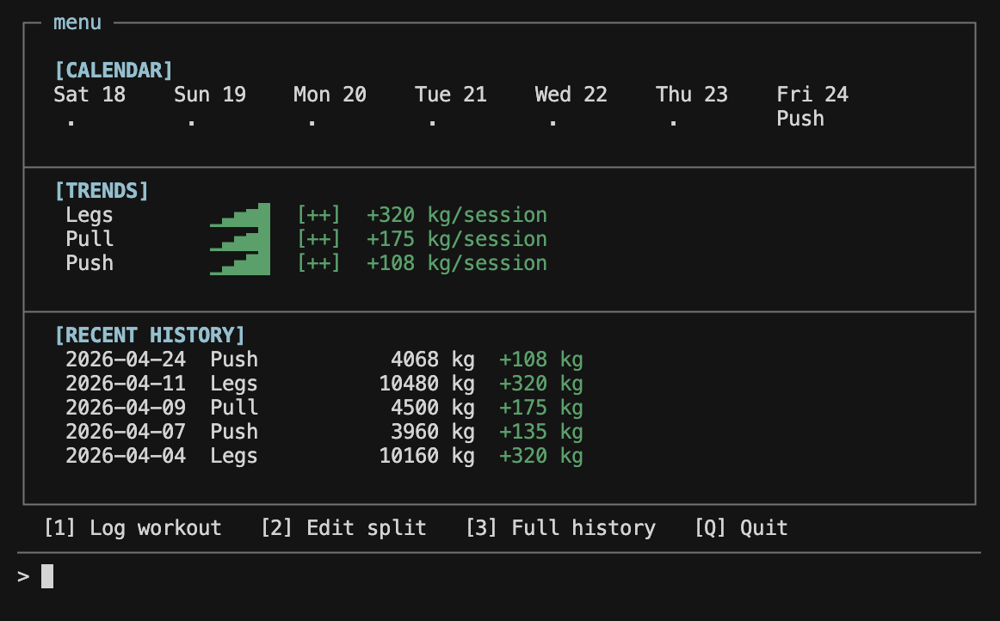

# Workout Notebook

A terminal-based workout tracker written in Java.

This project was developed as the final project for **2190103 Advanced Computer Programming**. 

You can watch the [presentation video](https://drive.google.com/file/d/1zx7-o6jtdGRzHai2521GmB_BvK5tp9Nx/view?usp=share_link) for the demo.

## Features

- Log workouts by split (Push / Pull / Legs / etc.)
- Track volume trends and progress over time
- Add, edit, and remove splits and exercises
- Persist workout data between sessions using CSV files

## Project Structure

- `src/` - Java source files
- `data/` - persistent CSV data (`sessions.csv`, `splits.csv`)

## Getting Started

### Requirements

- Java 8 or later

### Run from source

1. Compile:
   - `javac src/*.java -d bin`
2. Run:
   - `java -cp bin App`

## Design Patterns Used

| Pattern | Implementation |
| --- | --- |
| Singleton | `DataStore` |
| Observer | `WorkoutObserver` -> `StatsCalculator` |
| Factory | `ScreenFactory` |

## Class Diagram

- PDF version: [class_diagram.pdf](class_diagram.pdf)
- Image preview:

## Team

**Group: "I came, I saw, I withdraw"**

1. Punyathorn Nithithaniyamethakorn
2. Pannathart Isarabhakdi
3. Chetphisuth Tongpa